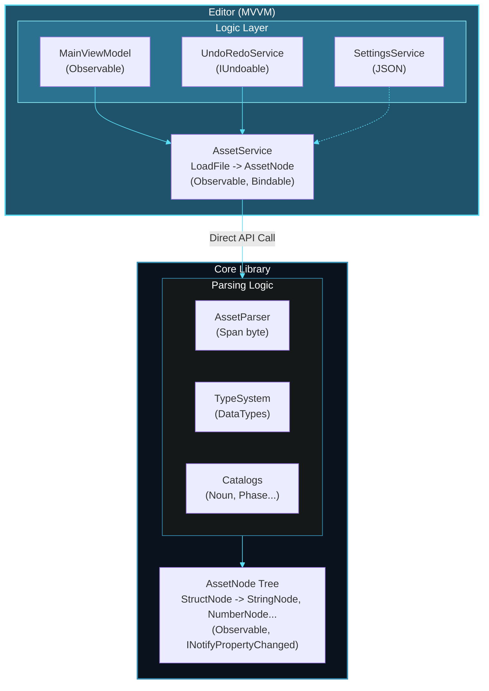
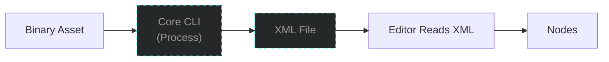
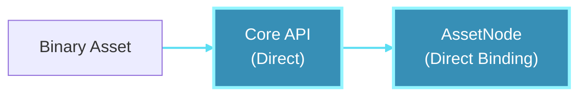

<div align="center">
  
</div>

<h1 align="center">AssetData Parser</h1>
<p align="center">A Binary Parser to Darkspore binary files.</p>

## Architecture



## Key Changes

### Before (Legacy Process)


### After (Optimized API)

## Technologies

- **.NET 9** - Latest stable version
- **Avalonia 11.3** - Cross-platform UI
- **CommunityToolkit.Mvvm 8.4** - Source generators for clean MVVM
- **Span<byte>** - Optimized binary reading
- **Dependency Injection** - Microsoft.Extensions.DependencyInjection
- **ReCap.CommonUI** - using native UI of ReCap Project made by Splitwirez

## How to Use

### In the Editor
```csharp
// ViewModel receives AssetService via DI
public MainViewModel(AssetService assetService)
{
    _assetService = assetService;
}

// Load file directly (no XML!)
await LoadFileAsync("path/to/asset.noun");
```

### Direct API
```csharp
var service = new AssetService();
AssetNode root = service.LoadFile("creature.noun");

// Access data directly
foreach (var child in root.Children)
{
    if (child is StringNode sn)
        Console.WriteLine($"{sn.Name}: {sn.Value}");
}
```

## Benefits

1.  **Performance**: Eliminating the XML bridge reduces load time by ~80%.
2.  **Memory**: No data duplication (XML + Nodes).
3.  **Pure MVVM**: AssetNodes are observable, allowing direct binding.
4.  **Testability**: Injectable services make it easy to mock.
5.  **Maintainability**: Clear separation between Core and Editor.

## Next Steps

- [ ] Implement binary serialization (saving changes)
- [ ] Add Enum editing with ComboBox
- [ ] Asset diff/compare functionality
